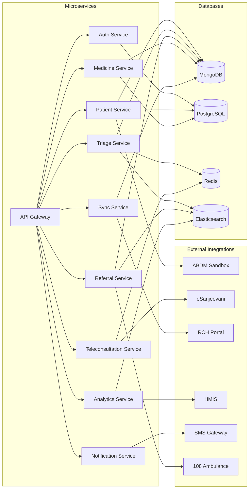
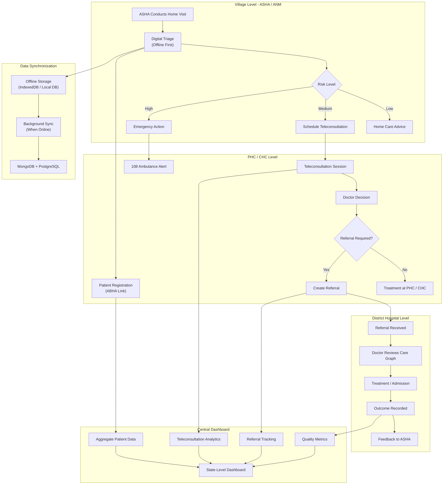
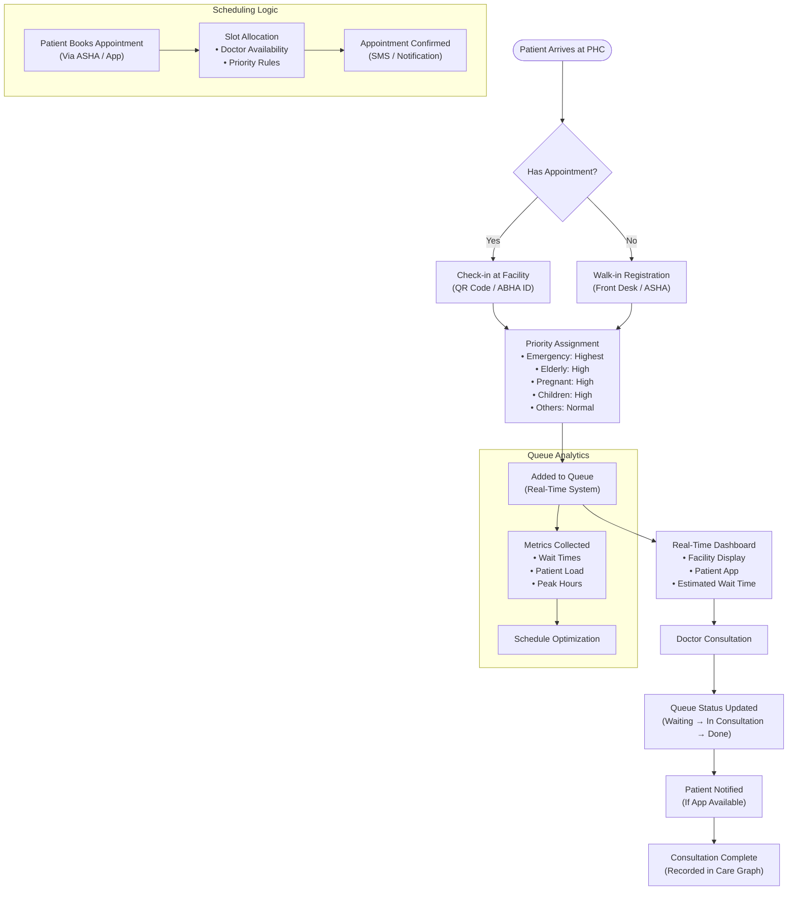
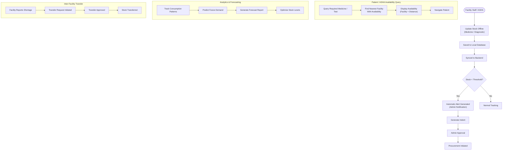
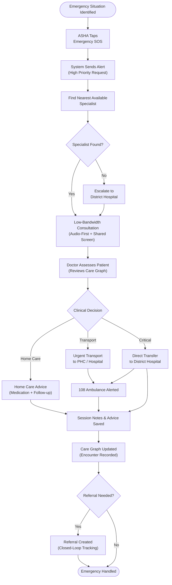
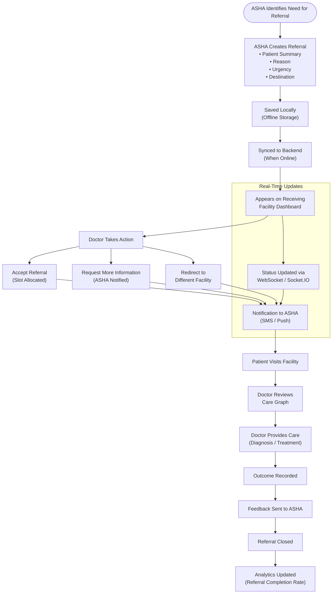
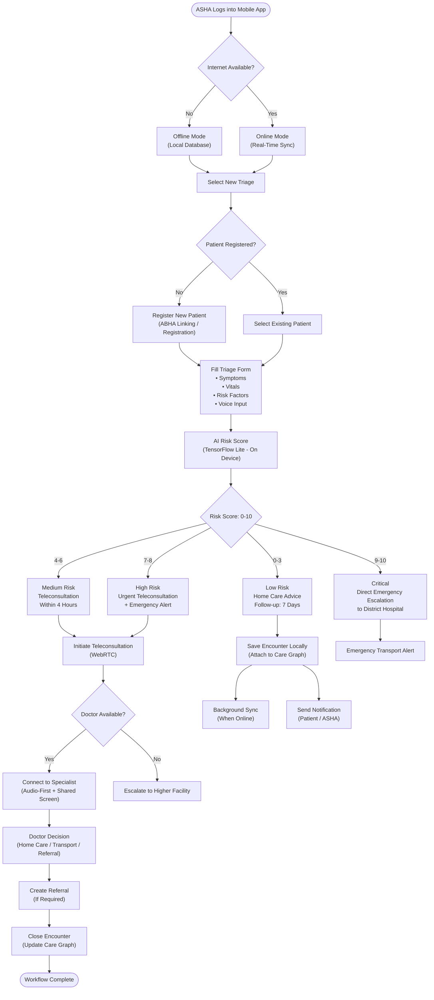
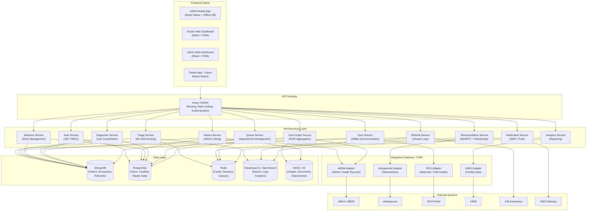

# Agada Platform

### Integrated Digital Healthcare Platform for Rural Maharashtra

> **Status:** 🚧 Under Development

Agada is an **offline-first, interoperable digital healthcare platform** designed to improve healthcare access and care coordination across rural and underserved regions of Maharashtra.

---

# Table of Contents

* [Overview](#overview)
* [Core Objectives](#core-objectives)
* [Key Features](#key-features)
* [Architecture](#architecture)

  * [Microservices Architecture](#microservices-architecture)
  * [End-to-End Healthcare Workflow](#end-to-end-healthcare-workflow)
  * [Patient Queue Management](#patient-queue-management)
  * [Medicine & Diagnostic Inventory](#medicine--diagnostic-inventory)
  * [Emergency Teleconsultation](#emergency-teleconsultation)
  * [Closed-Loop Referral](#closed-loop-referral)
  * [Offline-First Triage](#offline-first-triage)
  * [Complete System HLD](#complete-system-hld)
* [Project Structure](#project-structure)
* [Technology Stack](#technology-stack)
* [Quick Start](#quick-start)

---

# Overview

Rural healthcare delivery often faces challenges such as:

* Long distances to specialist healthcare
* Shortage of doctors and specialists
* Limited diagnostic facilities
* Intermittent internet connectivity
* Fragmented patient records
* Delayed referrals
* Poor visibility of medicine availability
* Limited coordination between healthcare facilities

Agada addresses these challenges through an **offline-first architecture combined with centralized healthcare services and interoperability standards**.

The platform connects **ASHAs, ANMs, PHCs, CHCs, rural hospitals, district hospitals, doctors, laboratories, administrators, and external healthcare systems** through a unified digital ecosystem.

---

# Core Objectives

1. Improve rural healthcare accessibility
2. Enable healthcare workflows without continuous internet connectivity
3. Reduce referral delays
4. Improve continuity of patient care
5. Enable low-bandwidth teleconsultation
6. Improve medicine and diagnostic availability
7. Provide healthcare authorities with operational visibility
8. Enable interoperability with government healthcare systems

---

# Key Features

* 📴 **Offline-First Healthcare**
* 📱 **ASHA/ANM Mobile Application**
* 🖥️ **Doctor & Facility Dashboards**
* 🤖 **AI-Assisted Triage**
* 🔄 **Closed-Loop Referral Management**
* 📞 **Low-Bandwidth Teleconsultation**
* 💊 **Medicine Inventory Management**
* 🧪 **Diagnostic Coordination**
* 🔔 **Real-Time Notifications**
* 📊 **Healthcare Analytics**
* 🌐 **Marathi, Hindi & English**
* 🔗 **FHIR-Based Interoperability**
* 🆔 **ABHA / ABDM Integration**
* 🚑 **Emergency Escalation & 108 Integration**

---

# Architecture

Agada follows a **microservices-oriented, offline-first architecture**.

The following diagrams describe the platform at different architectural and workflow levels.

---

## Microservices Architecture

This diagram describes communication between the API Gateway, backend microservices, external healthcare systems, and databases.



### Service Responsibilities

| Service                  | Responsibility                                   |
| ------------------------ | ------------------------------------------------ |
| Auth Service             | Authentication, authorization and RBAC           |
| Patient Service          | Patient registration and health identity linking |
| Triage Service           | Digital triage and AI-assisted risk scoring      |
| Referral Service         | Closed-loop referral management                  |
| Teleconsultation Service | Doctor consultation and WebRTC coordination      |
| Medicine Service         | Medicine inventory and stock management          |
| Notification Service     | SMS, push and system notifications               |
| Analytics Service        | Reporting and healthcare analytics               |
| Sync Service             | Offline synchronization and conflict resolution  |

---

## End-to-End Healthcare Workflow

This workflow shows how a patient moves from a village-level interaction through PHC/CHC care and, when required, to a district hospital.



---

# Patient Queue Management

The queue-management workflow handles both scheduled appointments and walk-in patients.



---

# Medicine & Diagnostic Inventory

The inventory workflow allows facilities to track medicine and diagnostic availability even when operating offline.



---

# Emergency Teleconsultation

The emergency workflow provides an audio-first, low-bandwidth communication path between frontline healthcare workers and doctors.



---

# Closed-Loop Referral

The referral workflow ensures that a referral is not considered complete until the receiving facility records the patient's outcome and feedback reaches the referring healthcare worker.



---

# Offline-First Triage

The triage workflow is designed to continue functioning when the ASHA has no network connectivity.



---

# Complete System HLD

The following diagram represents the overall High-Level Design of the Agada platform, from frontend applications to backend services, interoperability adapters, databases, and external government healthcare systems.



---

# Architecture Layers

The complete architecture can be understood as seven logical layers:

```text
┌─────────────────────────────────────────────┐
│              Client Applications             │
│       Mobile • Doctor • Admin • Patient      │
└───────────────────────┬─────────────────────┘
                        ↓
┌─────────────────────────────────────────────┐
│                 API Gateway                  │
│       Routing • Auth • Rate Limiting         │
└───────────────────────┬─────────────────────┘
                        ↓
┌─────────────────────────────────────────────┐
│              Business Services               │
│ Patient • Triage • Referral • Queue • etc.   │
└───────────────────────┬─────────────────────┘
                        ↓
┌─────────────────────────────────────────────┐
│           Integration / FHIR Layer           │
│      ABDM • eSanjeevani • RCH • HMIS         │
└───────────────────────┬─────────────────────┘
                        ↓
┌─────────────────────────────────────────────┐
│                   Data Layer                 │
│ PostgreSQL • MongoDB • Redis • Object Store  │
└───────────────────────┬─────────────────────┘
                        ↓
┌─────────────────────────────────────────────┐
│          Observability & Operations          │
│ Logs • Metrics • Traces • Alerts • Audits   │
└─────────────────────────────────────────────┘
```

---

# Project Structure

```text
agada-platform/
│
├── apps/
│   ├── mobile/
│   ├── web-dashboard/
│   └── admin/
│
├── services/
│   ├── auth-service/
│   ├── patient-service/
│   ├── triage-service/
│   ├── referral-service/
│   ├── telemedicine-service/
│   ├── medicine-service/
│   ├── diagnostic-service/
│   ├── queue-service/
│   ├── notification-service/
│   ├── analytics-service/
│   ├── care-graph-service/
│   ├── sync-service/
│   └── integration-gateway/
│
├── packages/
│   ├── shared-types/
│   ├── shared-utils/
│   ├── validation/
│   ├── api-client/
│   └── config/
│
├── infrastructure/
│   ├── docker/
│   ├── kubernetes/
│   ├── nginx/
│   ├── monitoring/
│   └── terraform/
│
├── scripts/
│   ├── seed-db.js
│   ├── migrate.js
│   ├── test-all.sh
│   └── deploy.sh
│
├── docs/
│   ├── architecture/
│   ├── api/
│   ├── security/
│   ├── deployment/
│   ├── interoperability/
│   └── user-manuals/
│
├── tests/
│   ├── integration/
│   ├── e2e/
│   └── performance/
│
├── .github/
│   └── workflows/
│       ├── ci.yml
│       ├── security.yml
│       └── deploy.yml
│
├── docker-compose.yml
├── turbo.json
├── package.json
├── tsconfig.json
├── .env.example
├── .gitignore
├── .eslintrc.js
├── .prettierrc
├── README.md
└── LICENSE
```

---

# Technology Stack

| Layer                   | Technology                 |
| ----------------------- | -------------------------- |
| Mobile                  | React Native               |
| Web                     | React, Vite, Tailwind CSS  |
| Backend                 | Node.js, TypeScript        |
| Python Services         | FastAPI                    |
| API                     | REST                       |
| Real-Time Communication | WebSocket / Socket.IO      |
| Teleconsultation        | WebRTC                     |
| Primary Database        | PostgreSQL                 |
| Document Database       | MongoDB                    |
| Cache / Queues          | Redis                      |
| Search / Analytics      | Elasticsearch / OpenSearch |
| Object Storage          | MinIO / S3                 |
| Mobile Offline Database | WatermelonDB               |
| Web Offline Storage     | IndexedDB                  |
| Interoperability        | HL7 FHIR R4                |
| ML                      | TensorFlow Lite            |
| Containerization        | Docker                     |
| Orchestration           | Kubernetes                 |
| Monitoring              | Prometheus + Grafana       |
| Distributed Tracing     | OpenTelemetry              |
| CI/CD                   | GitHub Actions             |

---

# Quick Start

## Prerequisites

* Node.js 20+
* npm / pnpm
* Docker
* Docker Compose
* Git
* Android Studio for Android development
* Xcode for iOS development

## Clone Repository

```bash
git clone https://github.com/yourusername/agada-platform.git

cd agada-platform
```

## Install Dependencies

```bash
npm install
```

## Configure Environment

```bash
cp .env.example .env
```

Configure database, authentication, external integrations, and other required environment variables.

## Start Infrastructure

```bash
docker compose up -d
```

## Start Development Environment

```bash
npm run dev
```

## Start an Individual Service

```bash
cd services/auth-service

npm run dev
```

---

# Project Vision

> **Agada is more than a healthcare application.**
>
> It is a digital coordination layer connecting the people, facilities, information, and services that form the rural healthcare ecosystem.
>
> When connectivity disappears, care should not stop.
>
> When a patient is referred, the referral should not disappear.
>
> When a patient reaches another facility, their essential clinical context should travel with them.
>
> And when healthcare authorities look at the system as a whole, they should be able to see where care is succeeding—and where it is breaking down.
>
> **Agada — Connected care, even where connectivity is limited.**
