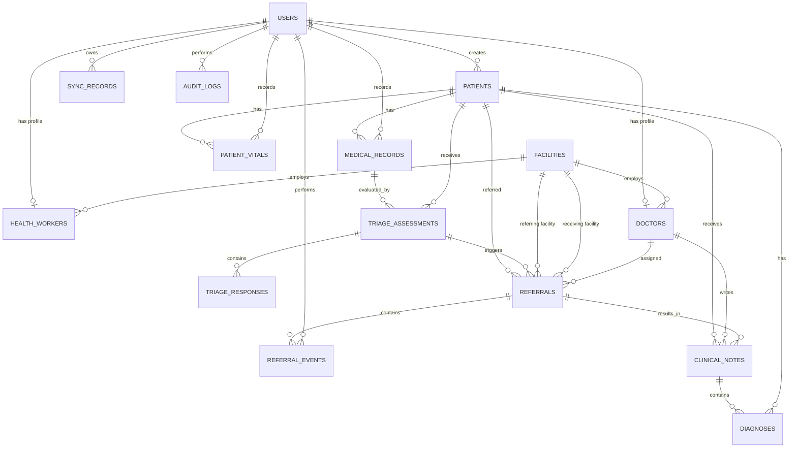

# Agada — Prototype ERD

## SIH Internal Evaluation — 30 September 2026

---

## 1. Purpose

This document defines the conceptual data model for the Agada prototype.

The model is derived directly from the Prototype SRS and Golden Workflows.

The database is intentionally limited to entities required to support:

* Authentication
* Role-based access
* Patient management
* Community clinical capture
* Triage
* Risk classification
* Referral
* Doctor consultation
* Clinical outcome
* Offline synchronization
* Auditability

The prototype database is **not** the complete long-term Agada healthcare database.

---

# 2. Design Principles

## 2.1 Workflow-driven design

Every entity must support at least one approved prototype workflow.

## 2.2 Separation of identity and clinical data

Authentication information belongs to `users`.

Clinical information belongs to patient/clinical entities.

## 2.3 Historical clinical data

Vitals, encounters, triage assessments, and clinical notes should be stored as historical records rather than overwriting previous information.

## 2.4 Traceability

The system should be able to answer:

```text
Who created this?
When was it created?
For which patient?
During which encounter?
What happened afterward?
```

## 2.5 Referral traceability

A referral should have both:

* Current status
* Historical status transitions

Therefore `referrals` and `referral_events` are separate entities.

## 2.6 Offline awareness

Records created while offline must have synchronization state and metadata.

---

# 3. High-Level ERD



---

# 4. Entity Overview

| Entity               | Purpose                                 |
| -------------------- | --------------------------------------- |
| `users`              | Authentication and identity             |
| `health_workers`     | ASHA/ANM-specific information           |
| `doctors`            | Doctor-specific information             |
| `facilities`         | PHC/CHC/hospital context                |
| `patients`           | Patient demographic and identity data   |
| `patient_vitals`     | Historical vital measurements           |
| `medical_records`    | Clinical encounters                     |
| `triage_assessments` | Triage result and risk classification   |
| `triage_responses`   | Individual triage answers and scoring   |
| `referrals`          | Current referral information            |
| `referral_events`    | Referral status history                 |
| `clinical_notes`     | Doctor consultation information         |
| `diagnoses`          | Diagnoses associated with clinical care |
| `sync_records`       | Offline synchronization state           |
| `audit_logs`         | Security and operational audit trail    |

---

# 5. Identity Model

## 5.1 Users

`users` is the central identity table.

```text
users
-----
id PK
email UK
phone UK
password_hash
role
first_name
last_name
is_active
created_at
updated_at
last_login_at
```

Supported prototype roles:

```text
ADMIN
HEALTH_WORKER
DOCTOR
```

### Relationship

```text
users
  │
  ├── health_workers
  │
  └── doctors
```

A specialized profile references exactly one user.

---

# 6. Healthcare Worker

## `health_workers`

Stores information specific to ASHA/ANM users.

```text
health_workers
--------------
id PK
user_id FK → users.id
facility_id FK → facilities.id
worker_type
employee_code
created_at
```

Supported worker types:

```text
ASHA
ANM
```

---

# 7. Doctor

## `doctors`

```text
doctors
-------
id PK
user_id FK → users.id
facility_id FK → facilities.id
registration_number UK
specialization
qualification
experience_years
is_available
created_at
```

A doctor belongs to a facility for the prototype.

---

# 8. Facility

## `facilities`

Represents a healthcare facility participating in the workflow.

```text
facilities
----------
id PK
name
facility_type
address
village
district
state
pincode
phone
is_active
created_at
```

Example facility types:

```text
PHC
CHC
DISTRICT_HOSPITAL
HOSPITAL
```

The exact enumeration can be finalized during database implementation.

---

# 9. Patient Model

## `patients`

Stores core patient identity and demographic information.

```text
patients
--------
id PK
patient_code UK

first_name
last_name
date_of_birth
gender

phone

address
village
district
state
pincode

blood_group

emergency_contact_name
emergency_contact_phone

health_id
consent_given

created_by FK → users.id

created_at
updated_at
```

### Important design decision

Clinical measurements should not be stored directly in the patient table.

For example:

```text
❌ patients.weight
❌ patients.temperature
❌ patients.heart_rate
```

Instead:

```text
patients
   ↓
patient_vitals
```

This preserves historical measurements.

---

# 10. Patient Vitals

## `patient_vitals`

Stores individual vital measurements.

```text
patient_vitals
--------------
id PK
patient_id FK → patients.id
recorded_by FK → users.id

temperature_celsius
heart_rate
respiratory_rate

systolic_bp
diastolic_bp

oxygen_saturation

weight_kg
height_cm

recorded_at
```

Relationship:

```text
PATIENT
   │
   ├── VITAL RECORD 1
   ├── VITAL RECORD 2
   └── VITAL RECORD N
```

---

# 11. Medical Record

## `medical_records`

Represents a clinical encounter or recorded healthcare interaction.

```text
medical_records
---------------
id PK
patient_id FK → patients.id
recorded_by FK → users.id

encounter_type

chief_complaint
symptoms
clinical_observations

record_status

recorded_at
created_at
```

A patient can have many medical records.

```text
PATIENT
   │
   ├── Encounter 1
   ├── Encounter 2
   └── Encounter N
```

---

# 12. Triage Assessment

## `triage_assessments`

Represents the result of an Agada triage process.

```text
triage_assessments
------------------
id PK

patient_id FK → patients.id
medical_record_id FK → medical_records.id
assessed_by FK → users.id

risk_level
score
recommendation

status
assessed_at
```

Supported risk levels:

```text
LOW
MEDIUM
HIGH
```

---

# 13. Triage Responses

## `triage_responses`

Stores the individual inputs used to produce the assessment.

```text
triage_responses
----------------
id PK
assessment_id FK → triage_assessments.id

question_code
question
response
score

created_at
```

Relationship:

```text
TRIAGE ASSESSMENT
       │
       ├── Response 1
       ├── Response 2
       ├── Response 3
       └── Response N
```

This makes the prototype triage process explainable.

---

# 14. Referral

## `referrals`

Represents a referral created for a patient.

```text
referrals
---------
id PK

patient_id FK → patients.id
triage_assessment_id FK → triage_assessments.id

referred_by FK → users.id

referring_facility_id FK → facilities.id
receiving_facility_id FK → facilities.id

assigned_doctor_id FK → doctors.id

urgency
reason

status

created_at
updated_at
```

Supported prototype status values:

```text
CREATED
ACCEPTED
IN_REVIEW
CONSULTATION
COMPLETED
REJECTED
CANCELLED
```

---

# 15. Referral Events

## `referral_events`

Stores the history of referral state changes.

```text
referral_events
---------------
id PK

referral_id FK → referrals.id

event_type

previous_status
new_status

performed_by FK → users.id

notes

created_at
```

Example history:

```text
CREATED
   ↓
ACCEPTED
   ↓
IN_REVIEW
   ↓
CONSULTATION
   ↓
COMPLETED
```

This enables referral tracking and closed-loop visibility.

---

# 16. Clinical Notes

## `clinical_notes`

Stores doctor consultation information.

```text
clinical_notes
--------------
id PK

patient_id FK → patients.id
referral_id FK → referrals.id
doctor_id FK → doctors.id

consultation_notes
treatment_plan
follow_up_instructions

created_at
```

A clinical note may be associated with a referral but remains part of the patient's clinical history.

---

# 17. Diagnoses

## `diagnoses`

Stores diagnoses recorded during clinical care.

```text
diagnoses
---------
id PK

patient_id FK → patients.id
clinical_note_id FK → clinical_notes.id

diagnosis_code
diagnosis_name
diagnosis_type
notes

created_at
```

For the prototype, `diagnosis_code` may remain optional.

---

# 18. Synchronization

## `sync_records`

Tracks data that needs to be synchronized between the client and server.

```text
sync_records
------------
id PK

user_id FK → users.id

entity_type
entity_id

operation

sync_status

client_timestamp
server_timestamp

error_message

created_at
```

Supported synchronization states:

```text
PENDING
SYNCING
SYNCED
FAILED
```

Supported operations:

```text
CREATE
UPDATE
```

Additional operations may be introduced later.

---

# 19. Audit Logs

## `audit_logs`

Provides basic traceability for important actions.

```text
audit_logs
----------
id PK

user_id FK → users.id

action

entity_type
entity_id

metadata

ip_address

created_at
```

Example actions:

```text
LOGIN
PATIENT_CREATED
PATIENT_VIEWED
TRIAGE_CREATED
REFERRAL_CREATED
REFERRAL_UPDATED
CONSULTATION_CREATED
SYNC_COMPLETED
```

---

# 20. Cardinality Summary

| Relationship                  | Cardinality |
| ----------------------------- | ----------- |
| User → Health Worker          | 1 : 0..1    |
| User → Doctor                 | 1 : 0..1    |
| Facility → Health Worker      | 1 : N       |
| Facility → Doctor             | 1 : N       |
| User → Patient Creator        | 1 : N       |
| Patient → Vitals              | 1 : N       |
| Patient → Medical Records     | 1 : N       |
| Medical Record → Triage       | 1 : N       |
| Triage Assessment → Responses | 1 : N       |
| Patient → Referrals           | 1 : N       |
| Referral → Referral Events    | 1 : N       |
| Doctor → Referrals            | 1 : N       |
| Referral → Clinical Notes     | 1 : N       |
| Clinical Note → Diagnoses     | 1 : N       |
| User → Sync Records           | 1 : N       |
| User → Audit Logs             | 1 : N       |

---

# 21. Prototype Data Flow

The complete data flow is:

```text
USER
 │
 ▼
PATIENT
 │
 ▼
MEDICAL_RECORD
 │
 ├───────────────┐
 ▼               ▼
VITALS         TRIAGE
                 │
                 ▼
              RISK LEVEL
                 │
                 ▼
              REFERRAL
                 │
                 ▼
          REFERRAL EVENTS
                 │
                 ▼
          DOCTOR CONSULTATION
                 │
          ┌──────┴──────┐
          ▼             ▼
    CLINICAL NOTE    DIAGNOSIS
          │
          ▼
       OUTCOME
          │
          ▼
    HEALTH WORKER
```

---

# 22. Service Ownership

The conceptual model should be mapped to the Agada microservice architecture.

| Service           | Primary Entities                                |
| ----------------- | ----------------------------------------------- |
| Auth Service      | `users`                                         |
| Patient Service   | `patients`, `patient_vitals`, `medical_records` |
| Triage Service    | `triage_assessments`, `triage_responses`        |
| Referral Service  | `referrals`, `referral_events`                  |
| Clinical Layer    | `clinical_notes`, `diagnoses`                   |
| Sync Service      | `sync_records`                                  |
| Platform / Shared | `audit_logs`                                    |
| Facility context  | `facilities`                                    |
| User profiles     | `health_workers`, `doctors`                     |

The exact physical database strategy may use separate service databases in the future.

For the prototype, implementation may use a shared PostgreSQL environment while maintaining **logical ownership boundaries** between services.

---

# 23. Intentionally Deferred Entities

The following are intentionally excluded from the prototype ERD:

```text
appointments
doctor_schedules
time_slots

medications
prescriptions
prescription_items

pharmacy_orders

lab_orders
lab_results

billing_records
payment_transactions
insurance_claims

teleconsultations

advanced analytics tables

government integration tables
```

These may be introduced in later iterations when their workflows are formally added to the scope.

---

# 24. ERD Design Rule

The prototype database should evolve according to this rule:

> **No table should be introduced merely because the production roadmap may eventually need it.**

A new prototype table should be added only when:

1. A scoped requirement needs it.
2. A golden workflow needs it.
3. The data cannot be represented appropriately by an existing entity.
4. Its ownership and lifecycle are understood.

---

# 25. Prototype Database Boundary

The prototype data model intentionally focuses on the continuous healthcare thread:

```text
Identity
   ↓
Patient
   ↓
Encounter
   ↓
Vitals
   ↓
Triage
   ↓
Risk
   ↓
Referral
   ↓
Doctor
   ↓
Clinical Outcome
   ↓
Closed-Loop Feedback
   ↓
Synchronization / Audit
```

This is the minimum coherent data model required to demonstrate the core Agada value proposition during the September 30 internal evaluation.
